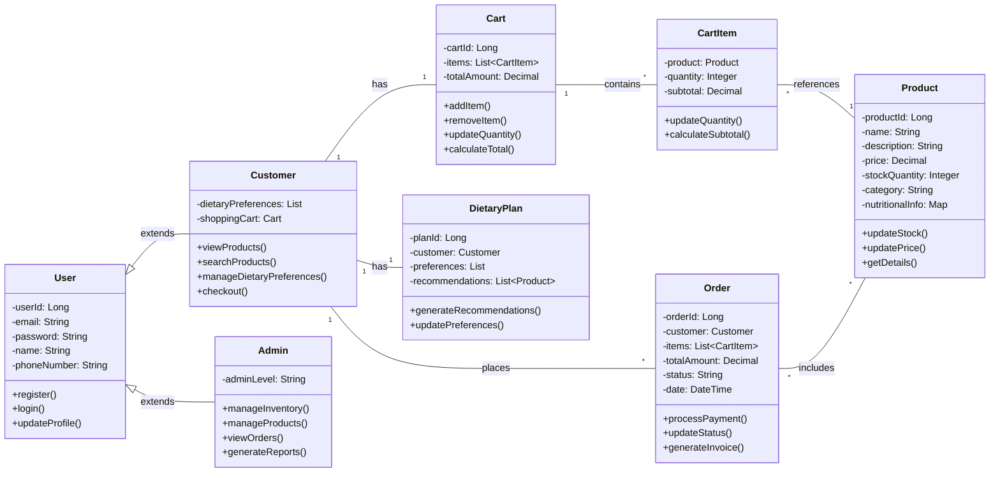

```mermaid
classDiagram
    direction LR
    
    class User {
        -userId: Long
        -email: String
        -password: String
        -name: String
        -phoneNumber: String
        +register()
        +login()
        +updateProfile()
    }

    class Customer {
        -dietaryPreferences: List
        -shoppingCart: Cart
        +viewProducts()
        +searchProducts()
        +manageDietaryPreferences()
        +checkout()
    }

    class Admin {
        -adminLevel: String
        +manageInventory()
        +manageProducts()
        +viewOrders()
        +generateReports()
    }

    class Product {
        -productId: Long
        -name: String
        -description: String
        -price: Decimal
        -stockQuantity: Integer
        -category: String
        -nutritionalInfo: Map
        +updateStock()
        +updatePrice()
        +getDetails()
    }

    class Cart {
        -cartId: Long
        -items: List~CartItem~
        -totalAmount: Decimal
        +addItem()
        +removeItem()
        +updateQuantity()
        +calculateTotal()
    }

    class CartItem {
        -product: Product
        -quantity: Integer
        -subtotal: Decimal
        +updateQuantity()
        +calculateSubtotal()
    }

    class Order {
        -orderId: Long
        -customer: Customer
        -items: List~CartItem~
        -totalAmount: Decimal
        -status: String
        -date: DateTime
        +processPayment()
        +updateStatus()
        +generateInvoice()
    }

    class DietaryPlan {
        -planId: Long
        -customer: Customer
        -preferences: List
        -recommendations: List~Product~
        +generateRecommendations()
        +updatePreferences()
    }

    User <|-- Customer : extends
    User <|-- Admin : extends
    Customer "1" -- "1" Cart : has
    Customer "1" -- "*" Order : places
    Customer "1" -- "1" DietaryPlan : has
    Cart "1" -- "*" CartItem : contains
    CartItem "*" -- "1" Product : references
    Order "*" -- "*" Product : includes
```