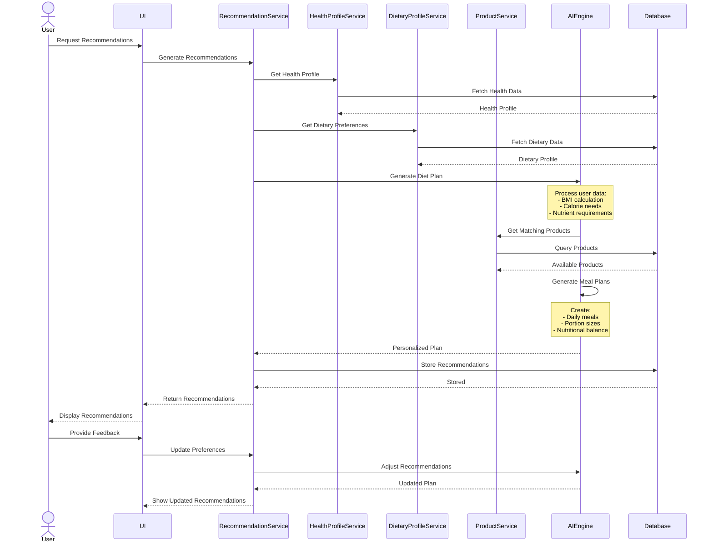

```mermaid
sequenceDiagram
    actor User
    participant UI
    participant RecommendationService
    participant HealthProfileService
    participant DietaryProfileService
    participant ProductService
    participant AIEngine
    participant Database

    %% Initial Recommendation Generation
    User->>UI: Request Recommendations
    UI->>RecommendationService: Generate Recommendations

    %% Gather User Data
    RecommendationService->>HealthProfileService: Get Health Profile
    HealthProfileService->>Database: Fetch Health Data
    Database-->>HealthProfileService: Health Profile
    
    RecommendationService->>DietaryProfileService: Get Dietary Preferences
    DietaryProfileService->>Database: Fetch Dietary Data
    Database-->>DietaryProfileService: Dietary Profile

    %% Process Recommendations
    RecommendationService->>AIEngine: Generate Diet Plan
    Note over AIEngine: Process user data:<br/>- BMI calculation<br/>- Calorie needs<br/>- Nutrient requirements
    
    AIEngine->>ProductService: Get Matching Products
    ProductService->>Database: Query Products
    Database-->>ProductService: Available Products
    
    AIEngine->>AIEngine: Generate Meal Plans
    Note over AIEngine: Create:<br/>- Daily meals<br/>- Portion sizes<br/>- Nutritional balance

    AIEngine-->>RecommendationService: Personalized Plan
    
    %% Store and Return Results
    RecommendationService->>Database: Store Recommendations
    Database-->>RecommendationService: Stored
    
    RecommendationService-->>UI: Return Recommendations
    UI-->>User: Display Recommendations

    %% Feedback Loop
    User->>UI: Provide Feedback
    UI->>RecommendationService: Update Preferences
    RecommendationService->>AIEngine: Adjust Recommendations
    AIEngine-->>RecommendationService: Updated Plan
    RecommendationService-->>UI: Show Updated Recommendations
```