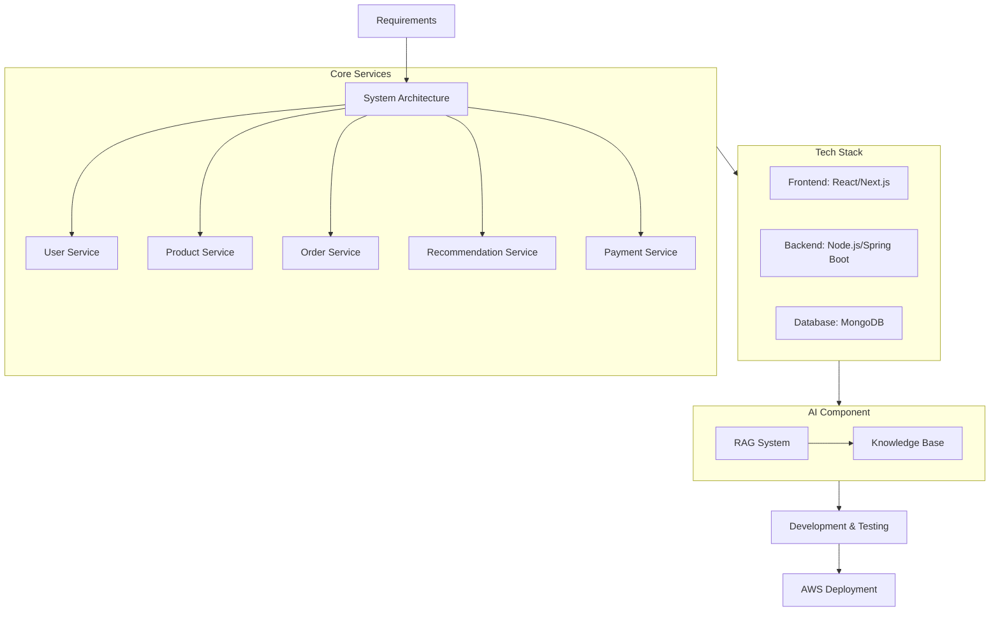

```mermaid
flowchart TD
    A[Requirements] --> B[System Architecture]
    
    subgraph Services[Core Services]
        B --> C[User Service]
        B --> D[Product Service]
        B --> E[Order Service]
        B --> F[Recommendation Service]
        B --> G[Payment Service]
    end
    
    subgraph Stack[Tech Stack]
        H[Frontend: React/Next.js]
        I[Backend: Node.js/Spring Boot]
        J[Database: MongoDB]
    end
    
    Services --> Stack
    
    subgraph AI[AI Component]
        K[RAG System]
        L[Knowledge Base]
        K --> L
    end
    
    Stack --> AI
    
    M[Development & Testing]
    AI --> M
    
    M --> N[AWS Deployment]
```