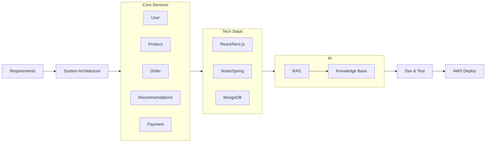

```mermaid
flowchart LR
    A[Requirements] --> B[System Architecture]
    
    subgraph Services[Core Services]
        direction LR
        C[User]
        D[Product]
        E[Order]
        F[Recommendations]
        G[Payment]
    end
    
    subgraph Stack[Tech Stack]
        direction LR
        H[React/Next.js]
        I[Node/Spring]
        J[MongoDB]
    end
    
    subgraph AI[AI]
        direction LR
        K[RAG] --> L[Knowledge Base]
    end
    
    B --> Services
    Services --> Stack
    Stack --> AI
    AI --> M[Dev & Test]
    M --> N[AWS Deploy]
```