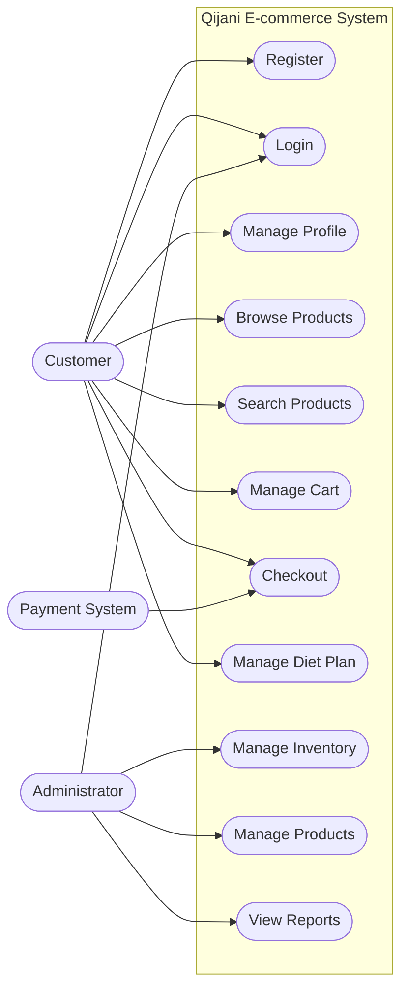

```mermaid
graph LR
    %% Actors
    Customer(["Customer"])
    Admin(["Administrator"])
    PaymentSystem(["Payment System"])
    
    subgraph Qijani["Qijani E-commerce System"]
        direction TB
        
        %% Use Cases
        Register(["Register"])
        Login(["Login"])
        ManageProfile(["Manage Profile"])
        
        BrowseProducts(["Browse Products"])
        SearchProducts(["Search Products"])
        ManageCart(["Manage Cart"])
        Checkout(["Checkout"])
        
        ManageDietPlan(["Manage Diet Plan"])
        
        ManageInventory(["Manage Inventory"])
        ManageProducts(["Manage Products"])
        ViewReports(["View Reports"])
    end
    
    %% Relationships
    Customer --> Register
    Customer --> Login
    Customer --> ManageProfile
    Customer --> BrowseProducts
    Customer --> SearchProducts
    Customer --> ManageCart
    Customer --> Checkout
    Customer --> ManageDietPlan
    
    Admin --> Login
    Admin --> ManageInventory
    Admin --> ManageProducts
    Admin --> ViewReports
    
    PaymentSystem --> Checkout    
```